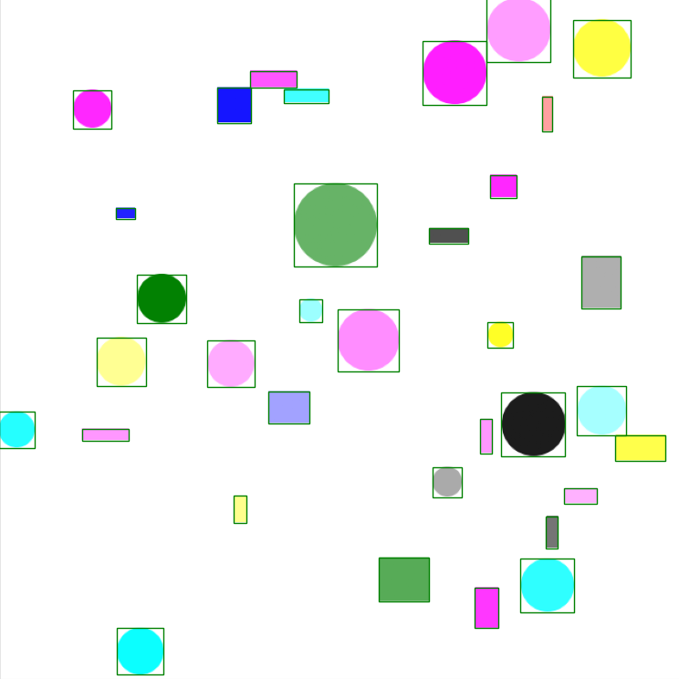

# shapes :large_blue_circle: :large_orange_diamond: :small_red_triangle: :red_circle:



Este repositório é um fork do [cjpurackal](https://github.com/cjpurackal) que foi amplamente alterado para implementar melhorias e atender novas necessidades.

O objetivo principal deste repositório é criar datasets para treinamento de modelos de detecção de objetos utilizando principalmente formas geométricas. Atualmente ele suporta a criação de retângulos e círculos com diferentes cores, opacidades e tamanhos.


## Pré-requisitos
No arquivo "requirements.txt" se encontram as bibliotecas externas e as versões utilizadas para testar este repositório. No teste foi utilizado o Python 3.11.3.

## Como rodar
Todas configurações de como deseja criar o dataset estão no início do arquivo "generate_dataset.py". Ao finalizar as configurações basta rodar o script "generate_dataset.py" que ele irá começar a gerar as imagens e os arquivos com as anotações.

Para visualizar o dataset que foi criado, pode ser executado o script "visualize.py" informando o caminho para a pasta do dataset (por padrão precisa conter uma pasta chamada "train" internamente). Ele irá abrir a primeira imagem dentro da pasta "train" com suas anotações de bounding boxes e ao fechá-la irá mostrar a próxima imagem, e assim sucessivamente.

```
python visualize.py --dataset_dir tmp/dataset
```

## Autor
* **cjpurackal** - [cjpurackal](https://github.com/cjpurackal)
### Autor do fork
* **Programador Artificial** - [GitHub](https://github.com/ProgramadorArtificial) - [YouTube](https://www.youtube.com/@ProgramadorArtificial)